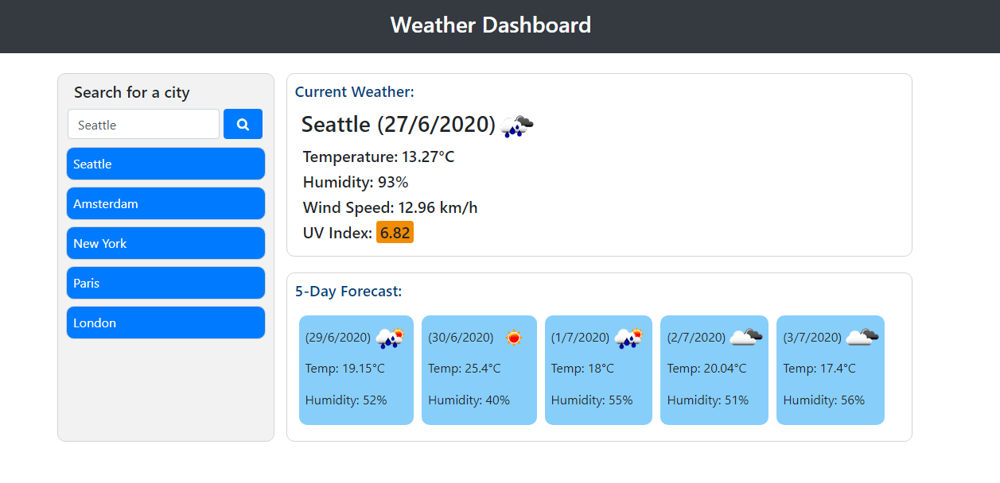

# Weather-Dashboard

06 Server-Side APIs: Weather Dashboard

https://cr-53.github.io/Weather-Dashboard/

## Task Description

The assignment for this week was to create a weather dashboard that took in a user's searched city and displayed current and future weather information on the screen provided by OpenWeatherMap's APIs. A history list of previous searches also had to be created and when an item in the history was clicked on, it had to perform the same function as if the item were searched. All persistent data had to be stored in local storage and the last searched city's weather information had to be loaded from local storage after closing and opening the page.

## Open Weather Map APIs

I used three different API calls to fetch current and future weather data for a chosen city. The first API call takes in a user's searched city as a paramater and displays the current temperature, humidity and wind speed for that city, along with a visual icon that represents the weather conditions. The second API call takes in the latitude & longitude of the searched city as parameters and displays the current UV Index for that city. The UV Index data was not available in the first API call's results, hence why a second API was required. The third API also took in latitude & longitude as parameters and displayed the future daily forecast for the next five days.

## Displaying the Information

To display the weather inforamtion, I used jQuery to create dynamic HTML elements containing the relevant data fetched from the three APIs. I tired to split up my code into numerous different functions that all had a clear purpose so that it was neater and easier to follow. An example of this is having one function to fetch the weather data from the API and another function to display it on the screen. 

## Local Storage

All persistent data was stored inside local storage using three different keys for each city; {city}weatherData, {city}uvData & {city}forecastData. These keys hold JSON blocks of data that was retrieved from the APIs and formatted to display on the screen. I also created an object inside local storage with the key set to "lastSearch" and the value being the name of the user's last searched city. I then parsed the value of this "lastSearch" local storage object into a function that displays the weather data of the last searched city upon page load, if there is a value saved in "lastSearch".

## License & copyright

© Chris R, University of Adelaide Coding Bootcamp
